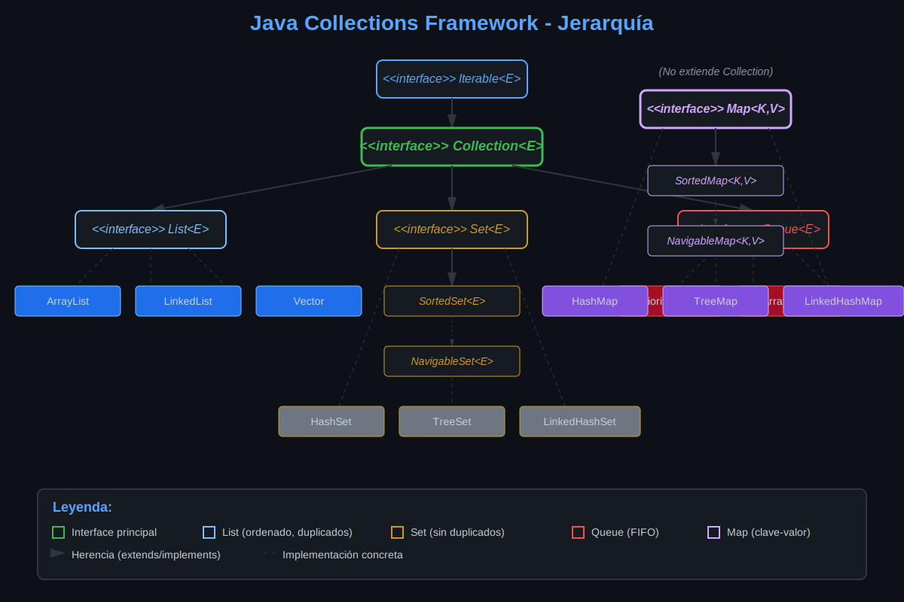

# Java Collections Framework

## 📚 Introducción

El **Java Collections Framework** (JCF) es una arquitectura unificada para representar y manipular colecciones de objetos. Proporciona interfaces, implementaciones y algoritmos para trabajar con grupos de datos de manera eficiente.

---

## 🏗️ Arquitectura del Framework

### Jerarquía de Interfaces

```
                    Iterable<E>
                        |
                   Collection<E>
                 /      |        \
               /        |         \
          List<E>    Set<E>    Queue<E>
                       |
                  SortedSet<E>
                       |
                NavigableSet<E>


              Map<E, V> (no extiende Collection)
                  |
             SortedMap<E, V>
                  |
           NavigableMap<E, V>
```



---

## 🔑 Interfaces Principales

### 1. Collection<E>

La **raíz** de la jerarquía de colecciones (excepto Map).

```java
public interface Collection<E> extends Iterable<E> {
    // Operaciones básicas
    boolean add(E e);
    boolean remove(Object o);
    boolean contains(Object o);
    int size();
    boolean isEmpty();
    void clear();
    
    // Operaciones en masa
    boolean addAll(Collection<? extends E> c);
    boolean removeAll(Collection<?> c);
    boolean retainAll(Collection<?> c);
    boolean containsAll(Collection<?> c);
    
    // Conversión a array
    Object[] toArray();
    <T> T[] toArray(T[] a);
    
    // Iteración
    Iterator<E> iterator();
}
```

---

### 2. List<E>

**Colección ordenada** que permite **elementos duplicados**. Los elementos se acceden por **índice**.

**Características:**
- ✅ Mantiene el orden de inserción
- ✅ Permite duplicados
- ✅ Acceso por índice (get, set)
- ✅ Puede contener null

**Implementaciones principales:**
- `ArrayList`: Array dinámico (más usado)
- `LinkedList`: Lista doblemente enlazada
- `Vector`: Thread-safe (legacy, evitar)

```java
import java.util.*;

public class EjemploList {
    public static void main(String[] args) {
        List<String> frutas = new ArrayList<>();
        
        // Agregar elementos
        frutas.add("Manzana");    // [Manzana]
        frutas.add("Banana");     // [Manzana, Banana]
        frutas.add("Manzana");    // [Manzana, Banana, Manzana] - permite duplicados
        
        // Acceso por índice
        String primera = frutas.get(0);  // "Manzana"
        
        // Modificar por índice
        frutas.set(1, "Naranja");  // [Manzana, Naranja, Manzana]
        
        // Insertar en posición específica
        frutas.add(1, "Uva");  // [Manzana, Uva, Naranja, Manzana]
        
        // Eliminar por índice
        frutas.remove(0);  // [Uva, Naranja, Manzana]
        
        // Tamaño
        System.out.println("Tamaño: " + frutas.size());
    }
}
```

---

### 3. Set<E>

**Colección sin elementos duplicados**. No mantiene orden específico (depende de la implementación).

**Características:**
- ✅ No permite duplicados
- ✅ Puede contener null (solo uno)
- ❌ No tiene acceso por índice
- ❌ El orden depende de la implementación

**Implementaciones principales:**
- `HashSet`: Basado en tabla hash (más rápido, sin orden)
- `LinkedHashSet`: Mantiene orden de inserción
- `TreeSet`: Ordenado naturalmente o por Comparator

```java
import java.util.*;

public class EjemploSet {
    public static void main(String[] args) {
        Set<String> colores = new HashSet<>();
        
        // Agregar elementos
        colores.add("Rojo");
        colores.add("Azul");
        colores.add("Verde");
        colores.add("Rojo");  // No se agrega (duplicado)
        
        System.out.println(colores);  // [Rojo, Azul, Verde] (sin duplicados)
        System.out.println("Tamaño: " + colores.size());  // 3
        
        // Verificar existencia
        boolean contiene = colores.contains("Azul");  // true
        
        // Eliminar
        colores.remove("Verde");
    }
}
```

---

### 4. Map<K, V>

**Colección de pares clave-valor**. No extiende Collection.

**Características:**
- ✅ Cada clave es única (no duplicados)
- ✅ Cada clave mapea a un solo valor
- ✅ Búsqueda rápida por clave
- ✅ Puede contener null (depende de la implementación)

**Implementaciones principales:**
- `HashMap`: Basado en tabla hash (más usado)
- `LinkedHashMap`: Mantiene orden de inserción
- `TreeMap`: Ordenado por claves
- `Hashtable`: Thread-safe (legacy, evitar)

```java
import java.util.*;

public class EjemploMap {
    public static void main(String[] args) {
        Map<String, Integer> edades = new HashMap<>();
        
        // Agregar pares clave-valor
        edades.put("Carlos", 25);
        edades.put("Ana", 30);
        edades.put("Luis", 28);
        edades.put("Carlos", 26);  // Actualiza el valor anterior
        
        // Obtener valor por clave
        Integer edadCarlos = edades.get("Carlos");  // 26
        
        // Verificar existencia
        boolean existe = edades.containsKey("Ana");  // true
        boolean tieneEdad = edades.containsValue(30);  // true
        
        // Eliminar por clave
        edades.remove("Luis");
        
        // Tamaño
        System.out.println("Tamaño: " + edades.size());  // 2
        
        // Iterar sobre entradas
        for (Map.Entry<String, Integer> entry : edades.entrySet()) {
            System.out.println(entry.getKey() + " -> " + entry.getValue());
        }
    }
}
```

---

### 5. Queue<E>

**Colección para procesamiento de elementos** en orden específico (FIFO normalmente).

**Características:**
- ✅ Orden de procesamiento definido
- ✅ Operaciones de cola (offer, poll, peek)
- ❌ Generalmente no permite null

**Implementaciones principales:**
- `LinkedList`: Implementa Queue (FIFO)
- `PriorityQueue`: Orden por prioridad
- `ArrayDeque`: Cola de doble extremo

```java
import java.util.*;

public class EjemploQueue {
    public static void main(String[] args) {
        Queue<String> cola = new LinkedList<>();
        
        // Agregar elementos (al final)
        cola.offer("Primero");
        cola.offer("Segundo");
        cola.offer("Tercero");
        
        // Ver el primero sin remover
        String primero = cola.peek();  // "Primero"
        
        // Remover y obtener el primero
        String removido = cola.poll();  // "Primero"
        
        System.out.println(cola);  // [Segundo, Tercero]
    }
}
```

---

## 📊 Comparación de Interfaces

| Interfaz | Duplicados | Orden | Acceso | Null | Uso Principal |
|----------|------------|-------|--------|------|---------------|
| **List** | ✅ Sí | ✅ Sí (inserción) | Por índice | ✅ Sí | Secuencias ordenadas |
| **Set** | ❌ No | Depende impl. | Solo iteración | ✅ Sí (uno) | Elementos únicos |
| **Map** | ❌ No (claves) | Depende impl. | Por clave | Depende impl. | Pares clave-valor |
| **Queue** | ✅ Sí | ✅ Sí (procesamiento) | Primero/Último | ❌ No | Colas de procesamiento |

---

## 🔧 Métodos Comunes de Collection

### Operaciones Básicas

```java
Collection<String> c = new ArrayList<>();

// Agregar
c.add("Elemento");                    // Agrega un elemento
c.addAll(Arrays.asList("A", "B"));    // Agrega múltiples elementos

// Eliminar
c.remove("Elemento");                 // Elimina un elemento específico
c.removeAll(Arrays.asList("A", "B")); // Elimina múltiples elementos
c.clear();                            // Elimina todos los elementos

// Consultar
boolean contiene = c.contains("A");   // Verifica si contiene un elemento
int tamaño = c.size();                // Obtiene el tamaño
boolean vacia = c.isEmpty();          // Verifica si está vacía

// Retener
c.retainAll(Arrays.asList("A", "C")); // Retiene solo elementos de la colección dada
```

---

## 🎯 Cuándo Usar Cada Interfaz

### Usa List cuando:
- Necesitas mantener el orden de inserción
- Requieres acceso por índice
- Permites elementos duplicados
- Ejemplo: Lista de tareas, historial de compras

### Usa Set cuando:
- No quieres duplicados
- No te importa el orden (o usas TreeSet/LinkedHashSet)
- Necesitas operaciones de conjuntos (unión, intersección)
- Ejemplo: Lista de emails únicos, tags de un artículo

### Usa Map cuando:
- Necesitas asociar claves con valores
- Requieres búsqueda rápida por clave
- Cada elemento tiene un identificador único
- Ejemplo: Diccionario, caché, configuración

### Usa Queue cuando:
- Procesamiento en orden específico
- Implementas colas de tareas
- Sistema de mensajería
- Ejemplo: Cola de impresión, buffer de eventos

---

## 💡 Ejemplo Integrador

```java
import java.util.*;

public class SistemaGestionEstudiantes {
    // List: Mantiene orden de registro
    private List<Estudiante> estudiantes = new ArrayList<>();
    
    // Set: Emails únicos
    private Set<String> emailsRegistrados = new HashSet<>();
    
    // Map: Búsqueda rápida por ID
    private Map<String, Estudiante> estudiantesPorId = new HashMap<>();
    
    // Queue: Cola de solicitudes de inscripción
    private Queue<Solicitud> solicitudesPendientes = new LinkedList<>();
    
    public boolean registrarEstudiante(Estudiante estudiante) {
        // Verificar email único
        if (emailsRegistrados.contains(estudiante.getEmail())) {
            System.out.println("Email ya registrado");
            return false;
        }
        
        // Agregar a las colecciones
        estudiantes.add(estudiante);
        emailsRegistrados.add(estudiante.getEmail());
        estudiantesPorId.put(estudiante.getId(), estudiante);
        
        return true;
    }
    
    public Estudiante buscarPorId(String id) {
        return estudiantesPorId.get(id);  // O(1) - búsqueda rápida
    }
    
    public List<Estudiante> obtenerTodos() {
        return new ArrayList<>(estudiantes);  // Copia defensiva
    }
    
    public void procesarSolicitudes() {
        while (!solicitudesPendientes.isEmpty()) {
            Solicitud solicitud = solicitudesPendientes.poll();
            procesarSolicitud(solicitud);
        }
    }
    
    private void procesarSolicitud(Solicitud solicitud) {
        // Lógica de procesamiento
    }
}

class Estudiante {
    private String id;
    private String nombre;
    private String email;
    
    // Constructor, getters y setters
    
    public Estudiante(String id, String nombre, String email) {
        this.id = id;
        this.nombre = nombre;
        this.email = email;
    }
    
    public String getId() { return id; }
    public String getNombre() { return nombre; }
    public String getEmail() { return email; }
}

class Solicitud {
    private String estudianteId;
    private String curso;
    
    // Constructor, getters y setters
}
```

---

## 🔄 Iterable e Iterator

Todas las colecciones implementan `Iterable<E>`, lo que permite:

```java
List<String> lista = Arrays.asList("A", "B", "C");

// For-each (usa Iterable internamente)
for (String elemento : lista) {
    System.out.println(elemento);
}

// Iterator explícito (permite eliminación segura)
Iterator<String> iterator = lista.iterator();
while (iterator.hasNext()) {
    String elemento = iterator.next();
    if (elemento.equals("B")) {
        iterator.remove();  // Eliminación segura durante iteración
    }
}
```

---

## ✅ Ventajas del Collections Framework

1. **Reduce el esfuerzo de programación**: Proporciona estructuras y algoritmos probados
2. **Aumenta la velocidad y calidad**: Implementaciones optimizadas
3. **Fomenta la reutilización**: Interfaces estándar
4. **Reduce el esfuerzo de diseño**: No necesitas crear tus propias colecciones
5. **Facilita la interoperabilidad**: APIs estandarizadas

---

## 📚 Recursos Adicionales

- [Java Collections Framework Overview - Oracle](https://docs.oracle.com/javase/8/docs/technotes/guides/collections/overview.html)
- [Collections API Documentation](https://docs.oracle.com/javase/8/docs/api/java/util/package-summary.html)
- [Effective Java - Item 54: Return empty arrays or collections, not nulls](https://www.oreilly.com/library/view/effective-java/9780134686097/)

---

**Próximo tema**: [Interface List](./03-interface-list.md)

---

*Semana 8 - Bootcamp POO Java - SENA*
